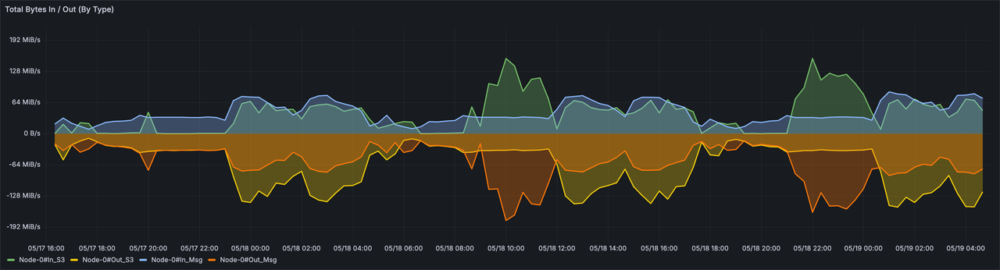
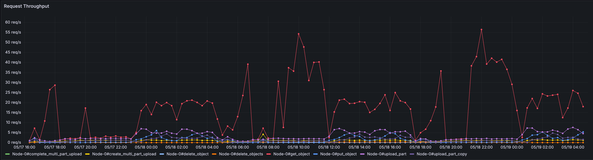

## Workload

This cost estimate is based on the following workload requirements:

- Write throughput: 500MB/s
- Production and consumption ratio: 1:1
- All Kafka Providers use a unified data retention time of 24 hours. Here, we assume that the storage system initially retains 24 hours of data. Given the write throughput, data retention for 24 hours, and the size of 1 copy of raw data is 24h * 3600s * 500MB/s, totaling 42187.5 GB.
- The total cost estimate is based on 1 month (720 hours).

## EC2

- Broker type: r6i.large, in/out baseline bandwidth (excluding burst) is 100MB/s
- Number of brokers: 12. For 500MB/s write throughput, AutoMQ requires 2.5 times the write throughput. This includes 1 copy for S3 upload, 1 copy for consumer read, and 0.5 copy for compaction. AutoMQ reads object data from S3 asynchronously for compaction to reduce metadata size, which on average consumes 0.5 times the write throughput. Therefore, for 500MB/s write throughput, the total out is 1250MB/s, which translates to 13 r6i.large EC2 instances.

Thus, the AutoMQ  [var.tfvars](../driver-automq/deploy/aws-cn/var.tfvars) configuration for the number of brokers/servers is as follows:

```
instance_type = {
  "server"              = "r6i.large"
  "broker"              = "r6i.large"
  "client"              = "r6i.large"
}

instance_cnt = {
  "server"              = 3
  "broker"              = 9
  "client"              = 5
}
```

> Tips: The client machines are fixed to 5 r6i.large instances, and this cost is automatically deducted in the Kafka Provider Comparison.

## SSD (per EC2)

AutoMQ's SSD cost is independent of data size. All Kafka Providers use a 64GB system volume. AutoMQ requires a fixed 10GB data volume for WAL data writes. Refer to AutoMQ's storage architecture design.

Due to AutoMQ's storage architecture design, the [var.tfvars](../driver-automq/deploy/aws-cn/var.tfvars) configuration for data volume EBS is as follows. The IOPS and throughput meet AWS's free tier standards.

```
ebs_volume_type = "gp3"
ebs_volume_size = 10
ebs_iops = 3000
ebs_throughput = 500
```

## S3

### Storage Space

AutoMQ uses EBS's multi-replica mechanism to ensure data durability, so only 1 copy of raw data is needed at the stream system level. For 500MB/s continuous write, the total storage space required is: 24 hours * 3600 seconds * 500 MB/s, totaling 42187.5 GB.

### API Call Usage Estimate

To accurately estimate AutoMQ's API calls in relation to traffic, we observed the actual operation of AutoMQ clusters. The API calls are positively correlated with write traffic. The following graphs show the traffic trend and API call request trend.


As shown, there is a strong correlation. The following table is based on sampled data.

| Get Request | Put Request | In S3 | Get / 100 MBps | Out S3 (broker->s3) | Put / 100 MBps | In Msg (MB/s) | Get / 100 MBps | Out Msg (MB/s) | Put / 100 MBps |
|-------------|-------------|-------|----------------|---------------------|----------------|---------------|----------------|----------------|----------------|
| 8.01        | 8           | 25.3  | 31.66          | 78.5                | 10.19          | 52.4          | 15.29          | 53.4           | 14.98          |
| 17.4        | 12.46       | 48.4  | 35.95          | 104                 | 11.98          | 55.4          | 31.41          | 55.9           | 22.29          |
| 20.3        | 13.95       | 55.2  | 36.78          | 124                 | 11.25          | 68.5          | 29.64          | 68.9           | 20.25          |
| 10.6        | 6.09        | 26.1  | 40.61          | 48.4                | 12.58          | 25.8          | 41.09          | 30.8           | 19.77          |
| 12          | 4.3         | 4.43  | 270.88         | 21.8                | 19.72          | 21.1          | 56.87          | 25.5           | 16.86          |
| 27.9        | 5.36        | 71.3  | 39.13          | 35.6                | 15.06          | 34.2          | 81.58          | 89             | 6.02           |
| 31.8        | 5.27        | 90.5  | 35.14          | 38.7                | 13.62          | 36            | 88.33          | 124            | 4.25           |
| 19.7        | 13.61       | 56.3  | 34.99          | 126                 | 10.80          | 69.5          | 28.35          | 69.9           | 19.47          |
| 18.6        | 12.71       | 50.1  | 37.13          | 112                 | 11.35          | 62.4          | 29.81          | 62.8           | 20.24          |
| 15.1        | 9.71        | 39.5  | 38.23          | 81.4                | 11.93          | 41            | 36.83          | 41.7           | 23.29          |
| 12.2        | 3.41        | 11    | 110.91         | 23.2                | 14.70          | 18.6          | 65.59          | 25.7           | 13.27          |
| 11.9        | 8.367       | 49.4  | 24.09          | 62.2                | 13.45          | 40.4          | 29.46          | 65.8           | 12.72          |

Based on the number of Get and Put requests per MB of write traffic, AutoMQ's 500MB/s write traffic corresponds to 147.3 PUT and 63.6 GET requests. For continuous 500MB/s write traffic, the API usage is estimated as follows for 30 days: PUT requests = 30 days * 24 hours * 3600 seconds * 147.3 = 381,801,600; GET requests = 30 days * 24 hours * 3600 seconds * 63.6 = 164,851,200.

### Infracost usage configuration file

Based on the above usage analysis, we have modified the default `template-medium-500m.yml` configuration file to [automq-medium-500m.yml](../infracost/automq-medium-500m.yml), adjusting the following default usage values related to S3:

```yaml
version: 0.1
resource_usage:
  aws_s3_bucket:
    my_bucket:
      monthly_get_requests: 164851200
      monthly_put_requests: 381801600
      monthly_storage_gb: 42187.5
```

## Why is the total cost higher than the data provided on the official website?

From the Benchmark experiment results, it can be seen that the cost of AutoMQ is about 5% of the total cost of Kafka, rather than 10%. This is mainly because our automated comparison platform has not yet introduced AutoScaling and Spot instances, and therefore, the cost reductions brought about by these two capabilities are not reflected.
